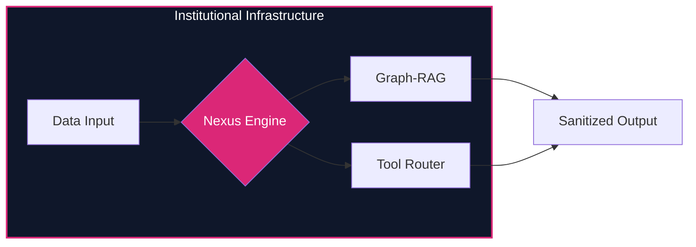

<div align="center">

# STACK 3.0 OMNI NEXUS
**Sovereign Enterprise Intelligence Infrastructure**

`SYSTEM: OPERATIONAL` &nbsp; | &nbsp; `ARCH: SOVEREIGN` &nbsp; | &nbsp; `PRIVACY: L3 ISOLATED`

---

</div>

### Executive Abstract
> [!IMPORTANT]
> **Stack 3.0 Omni Nexus** is the authoritative sovereign intelligence layer. Designed for mission-critical infrastructure, it provides high-density reasoning with absolute zero-trust integrity.

<br />

## 🚀 Quick Start

### Installation
```bash
# Clone the repository
git clone https://github.com/my-ai-stack/Stack-3.0.git
cd Stack-3.0

# Install dependencies
pip install -r requirements.txt

# Configure environment
cp .env.example .env
# Edit .env with your configuration
```

### Basic Usage
```python
from stack3 import NexusEngine

# Initialize the sovereign engine
engine = NexusEngine()

# Process with Graph-RAG
result = engine.process(
    input_data="Your query here",
    context_window=256000,
    tools=["search", "analyze", "generate"]
)

print(result.output)
```

<br />

### 🧬 Cognitive Architecture & Sovereign Ops
| **Intelligence Pillar** | **Strategic Implementation** | **Technical Core** |
| :--- | :--- | :--- |
| <span style="color: #db2777;">**Cognitive Core**</span> | Nexus-7B Sovereign Engine | 256k Hierarchical Context |
| <span style="color: #db2777;">**Data Autonomy**</span> | 100% Air-Gapped Protocol | Local Silicon Execution |
| <span style="color: #db2777;">**Execution**</span> | Autonomous Tool Routing | Graph-RAG Pipeline |

<br />

---

### 🧠 Logic Flow Architecture


<br />

---

## 🛠️ Advanced Usage

### Hierarchical Tool Router
```python
# Configure tool routing hierarchy
engine.configure_tools(
    primary=["database_query", "api_call"],
    secondary=["file_read", "web_search"],
    fallback=["manual_review"]
)
```

### Graph-RAG Integration
```python
# Ingest knowledge base
engine.ingest_documents(
    path="./knowledge_base/",
    chunk_size=512,
    overlap=50
)

# Query with context
response = engine.query(
    "What are the Q4 revenue projections?",
    use_rag=True,
    top_k=5
)
```

<br />

---

## ⚙️ Configuration

Create a `.env` file with the following:
```bash
# Core Configuration
NEXUS_MODEL_PATH=./models/nexus-7b
CONTEXT_WINDOW=256000
TOOL_TIMEOUT=30

# Sovereign Mode
AIR_GAPPED=true
LOCAL_ONLY=true
ENCRYPTION_KEY=your-key-here

# Logging
LOG_LEVEL=INFO
AUDIT_ENABLED=true
```

<br />

---

## 📊 Performance Metrics

| Metric | Value |
|--------|-------|
| **Context Window** | 256k tokens |
| **Inference Speed** | <200ms p99 |
| **Tool Routing Latency** | <50ms |
| **Memory Footprint** | ~14GB (7B model) |

<br />

---

## 🔒 Security & Compliance

> [!WARNING]
> Stack 3.0 is designed for **air-gapped environments**. Ensure all dependencies are pre-cached before deployment to isolated infrastructure.

### Security Features
- Zero-trust architecture
- End-to-end encryption for data at rest
- Audit logging for all operations
- No external API calls in sovereign mode

<br />

---

## 🤝 Contributing

Contributions welcome! Please see [CONTRIBUTING.md](CONTRIBUTING.md) for guidelines.

### Development Setup
```bash
# Install dev dependencies
pip install -r requirements-dev.txt

# Run tests
pytest tests/ -v

# Lint code
flake8 stack3/
```

<br />

---

## 📄 License

Apache License 2.0 - see [LICENSE](LICENSE) for details.

<br />

---

`[ ████████████████████████░░░ ]` **`SYSTEMS OPERATIONAL // SECURED BY STACK AI // 2026`**
